# Jollibee REST API - Project 1 year 2024

Disclaimer: 
            This project Jollibee REST API, created by Jeremy Opriasa, is a first personal project - manifestation for this year 2024. This has nothing to do with Jollibee corporation itself.

Hi!

If you happen to run this Jollibee API on your computer, allow me to run it through for you as I list here the step by step process.

First, make sure you have downloaded xampp which will run the apache server and open the mysql environment.
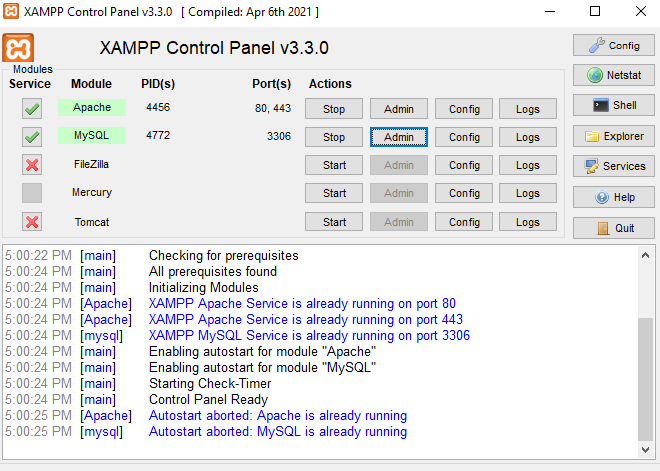

Second, click the admin on xampp and it will redirect you to phpMyAdmin where you can start your own database by clicking the New (on the upper left side of the page).
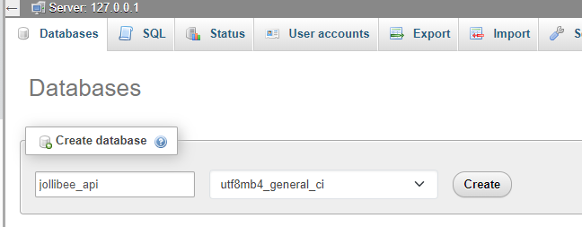

Third, as you create the database, look for the import panel where you may import all the tables from exported_tables, so that you have your own copy on your server, and don't worry I already generated some data, feel free to play around.
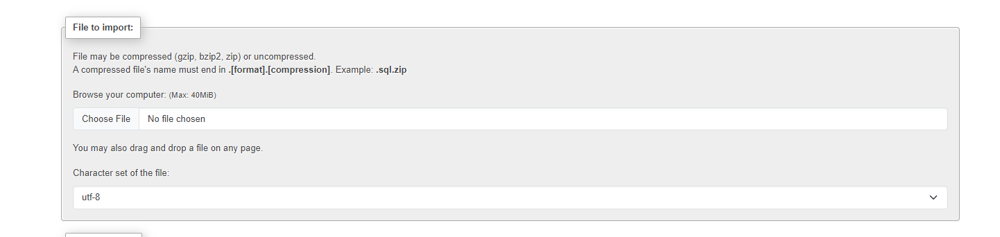
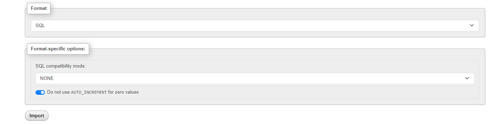

PS. Make sure to leave everything as default and click the import button below

Now, for the API part.

First, open the Postman application on your own computer/laptop and on your own workspace, create: Jollibee REST API
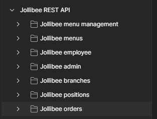

Here are my collections and requests
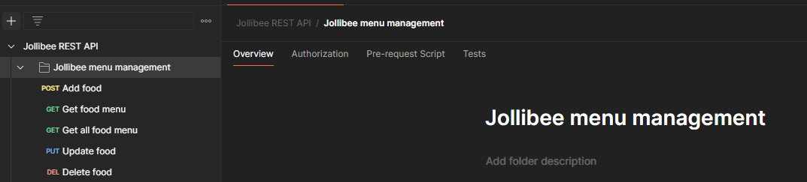
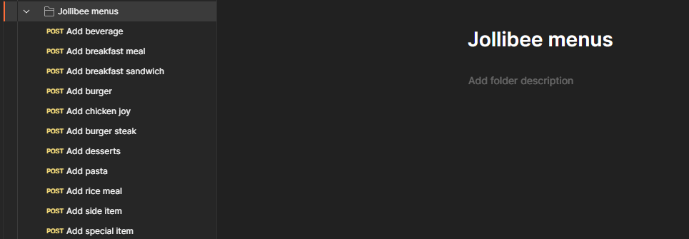
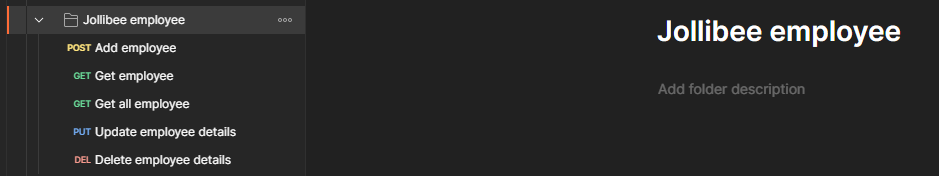
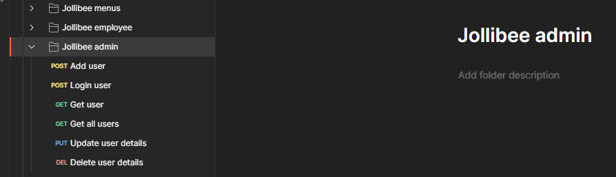
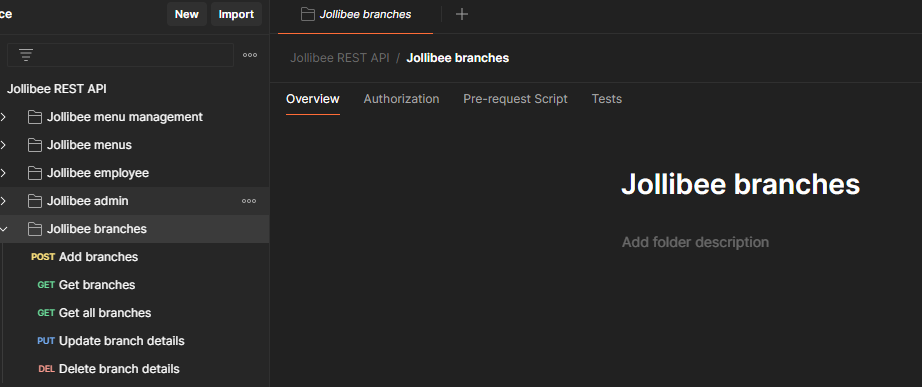
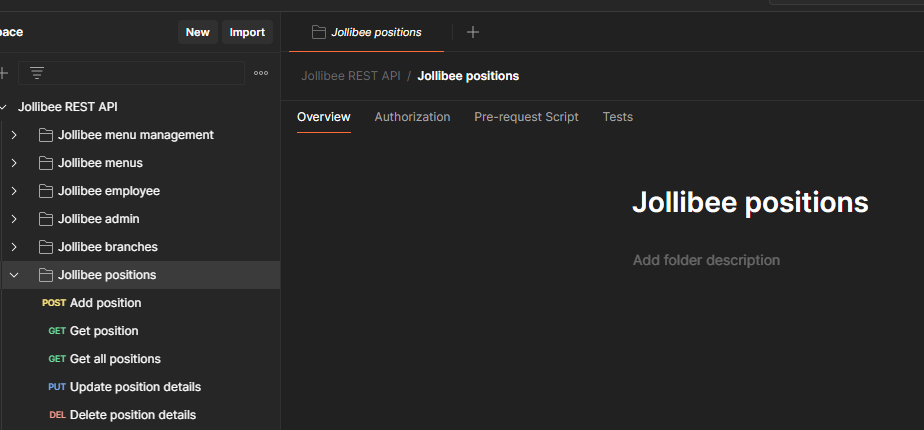
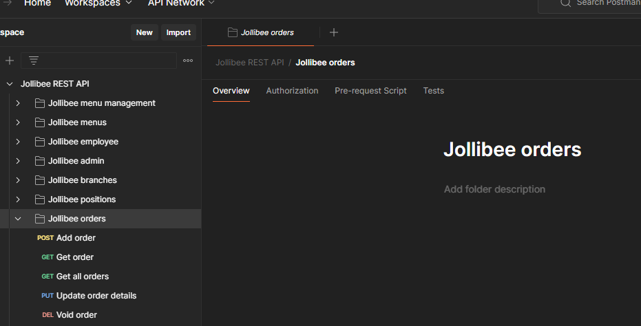

As example of successful request:
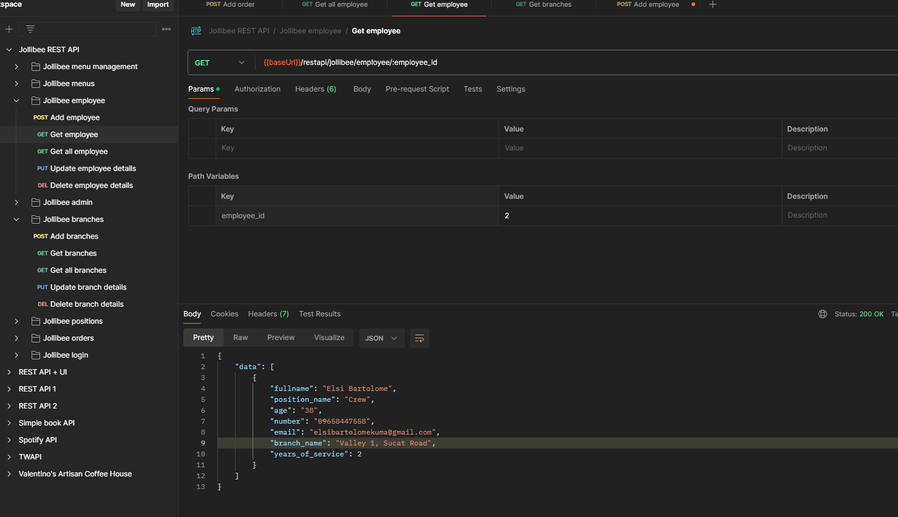

That's it for this Jollibee API project, once you have your own copy, feel free to play around and add something for your comfort of this project.

If you do have offers, kindly visit my own portfolio: https://opriasaweb.github.io/opriasa-de-portfolio/

Subscribe to my youtube channel: https://www.youtube.com/channel/UCgi6J20rFtQBuff9fcVS0Sg

Chop wood, carry water!
Thank you!
